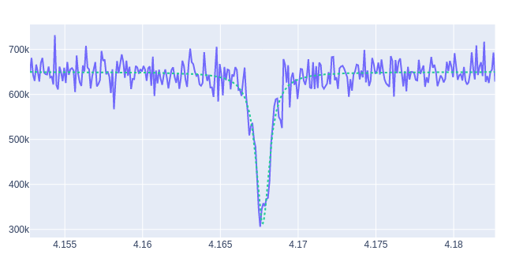

Examples
========

Let's now do some examples of how to use ``Qibosoq``.
Note that, for these examples to be run, the Qibosoq server needs to be running and reachable from the client.

A standard program will be executed with something like:

.. code-block:: python

    import json
    import socket

    from qibosoq.client import execute

    HOST = "192.168.0.200"
    PORT = 6000

    server_commands = {...}
    i_values, q_values = execute(server_commands, HOST, PORT)

Execution of a sequence of pulses
"""""""""""""""""""""""""""""""""

To send a simple pulse sequence, we just needed to define all the server_commands to be sent with the ``qibosoq_execute`` function:

.. code-block:: python

    from qibosoq.client import execute
    from qibosoq.components.base import (
        Qubit,
        OperationCode,
        Config
    )
    from qibosoq.components.pulses import Rectangular

    pulse_1 = Rectangular(
                frequency = 5400, #MHz
                amplitude = 0.05,
                relative_phase = 0,
                start_delay = 0,
                duration = 0.04,
                name = "drive_pulse",
                type = "drive",
                dac = 0,
                adc = None
    )

    pulse_2 = Rectangular(
                frequency = 6400, #MHz
                amplitude = 0.05,
                relative_phase = 0,
                start_delay = 0.04,
                duration = 2,
                name = "readout_pulse",
                type = "readout",
                dac = 1,
                adc = 0
    )

    sequence = [pulse_1, pulse_2]
    config = Config()
    qubit = Qubit()

    server_commands = {
        "operation_code": OperationCode.EXECUTE_PULSE_SEQUENCE,
        "cfg": config,
        "sequence": sequence,
        "qubits": [qubit],
    }

    i, q = execute(server_commands, HOST, PORT)

    print(f"{i} + 1j * {q}")

    > [[...]] + 1j * [[...]]

For multiple readout pulses, on the same dac:

.. code-block:: python

    from qibosoq.client import execute
    from qibosoq.components.base import (
        Qubit,
        OperationCode,
        Config,
        Sweeper,
        Parameter
    )
    from qibosoq.components.pulses import Rectangular

    pulse_1 = Rectangular(
                frequency = 6400, #MHz
                amplitude = 0.05,
                relative_phase = 0,
                start_delay = 0,
                duration = 0.04,
                name = "readout_pulse_0",
                type = "readout",
                dac = 1,
                adc = 0
    )

    pulse_2 = Rectangular(
                frequency = 6400, #MHz
                amplitude = 0.05,
                relative_phase = 0,
                start_delay = 0.04,
                duration = 2,
                name = "readout_pulse",
                type = "readout",
                dac = 1,
                adc = 0
    )

    sequence = [pulse_1, pulse_2]
    config = Config()
    qubit = Qubit()

    server_commands = {
        "operation_code": OperationCode.EXECUTE_PULSE_SEQUENCE,
        "cfg": config,
        "sequence": sequence,
        "qubits": [qubit],
    }

    i, q = execute(server_commands, HOST, PORT)

    print(f"{i} + 1j * {q}")

    > [[...,...]] + 1j * [[...,...]]

While if the measurement is done on a different adc the result will be slightly different:

.. code-block:: python

    from qibosoq.client import execute
    from qibosoq.components.base import (
        Qubit,
        OperationCode,
        Config,
        Sweeper,
        Parameter
    )
    from qibosoq.components.pulses import Rectangular

    pulse_1 = Rectangular(
                frequency = 6400, #MHz
                amplitude = 0.05,
                relative_phase = 0,
                start_delay = 0,
                duration = 0.04,
                name = "readout_pulse_0",
                type = "readout",
                dac = 2,
                adc = 1
    )

    pulse_2 = Rectangular(
                frequency = 6400, #MHz
                amplitude = 0.05,
                relative_phase = 0,
                start_delay = 0.04,
                duration = 2,
                name = "readout_pulse",
                type = "readout",
                dac = 1,
                adc = 0
    )

    sequence = [pulse_1, pulse_2]
    config = Config()
    qubit = Qubit()

    server_commands = {
        "operation_code": OperationCode.EXECUTE_PULSE_SEQUENCE,
        "cfg": config,
        "sequence": sequence,
        "qubits": [qubit],
    }

    i, q = execute(server_commands, HOST, PORT)

    print(f"{i} + 1j * {q}")

    > [[...],[...]] + 1j * [[...],[...]]

Execution of a sweeper experiment
"""""""""""""""""""""""""""""""""

A sweeper is a fast scan on a pulse parameter, executed on the FPGA logic to maximize the speed.

.. code-block:: python

    from qibosoq.client import execute
    from qibosoq.components.base import (
        Qubit,
        OperationCode,
        Config
        Sweeper,
        Parameter
    )
    from qibosoq.components.pulses import Rectangular

    pulse_1 = Rectangular(
                frequency = 5400, #MHz
                amplitude = 0.05,
                relative_phase = 0,
                start_delay = 0,
                duration = 0.04,
                name = "drive_pulse",
                type = "drive",
                dac = 0,
                adc = None
    )

    pulse_2 = Rectangular(
                frequency = 6400, #MHz
                amplitude = 0.05,
                relative_phase = 0,
                start_delay = 0.04,
                duration = 2,
                name = "readout_pulse",
                type = "readout",
                dac = 1,
                adc = 0
    )

    sequence = [pulse_1, pulse_2]
    config = Config()
    qubit = Qubit()

    sweeper = Sweeper(
                parameters = [Parameter.AMPLITUDE],
                indexes = [0],
                starts = [0],
                stops = [1],
                expts = 100
    )

    server_commands = {
        "operation_code": OperationCode.EXECUTE_SWEEPS,
        "cfg": config,
        "sequence": sequence,
        "qubits": [qubit],
        "sweepers": [sweeper],
    }

    i, q = execute(server_commands, HOST, PORT)

    print(f"{i} + 1j * {q}")

    > [[...,...,...,...]] + 1j * [[...,...,...,...]]

Example of a qubit spectroscopy
"""""""""""""""""""""""""""""""

As a real example, let's perform a qubit spectroscopy experiment.

We first import all the needed ``qibosoq`` components and ``matplotlib`` for plotting:

.. code-block:: python

    import numpy as np
    import matplotlib.pyplot as plt

    from qibosoq.client import execute
    from qibosoq.components.base import (
        Qubit,
        OperationCode,
        Config,
        Sweeper,
        Parameter
    )
    from qibosoq.components.pulses import Rectangular

In a qubit spectroscopy experiment we send two pulses: the first drives a qubit but has a variable frequency (we will use a sweeper) and the second is a fix readout pulse.

.. code-block:: python

    pulse_1 = Rectangular(
                frequency = 5400, #MHz
                amplitude = 0.05,
                relative_phase = 0,
                start_delay = 0,
                duration = 0.04,
                name = "drive_pulse",
                type = "drive",
                dac = 0,
                adc = None
    )

    pulse_2 = Rectangular(
                frequency = 6400, #MHz
                amplitude = 0.05,
                relative_phase = 0,
                start_delay = 0.04,
                duration = 2,
                name = "readout_pulse",
                type = "readout",
                dac = 1,
                adc = 0
    )

    sequence = [pulse_1, pulse_2]

Next, we can define the sweeper:

.. code-block:: python

    sweeper = Sweeper(
                parameters = [Parameter.FREQUENCY],
                indexes = [0],
                starts = [4154],
                stops = [4185],
                expts = 150
    )

Now we can define the :class:`qibosoq.components.base.Config` object and our :class:`qibosoq.components.base.Qubit` object:

.. code-block:: python

    config = Config(
        repetition_duration = 10,
        reps = 2000
    )
    qubit = Qubit(
        bias = 0.1,
        dac = 3
    )

And we can execute and plot the results:

.. code-block:: python

    server_commands = {
        "operation_code": OperationCode.EXECUTE_SWEEPS,
        "cfg": config,
        "sequence": sequence,
        "qubits": [qubit],
        "sweepers": [sweeper],
    }

    i, q = execute(server_commands, HOST, PORT)

    frequency = np.linspace(sweeper.starts[0], sweeper.stops[0], sweeper.expts)
    results = np.array(i[0][0]) + 1j * np.array(q[0][0])
    plt.plot(frequency, np.abs(results))

