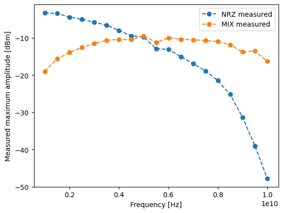
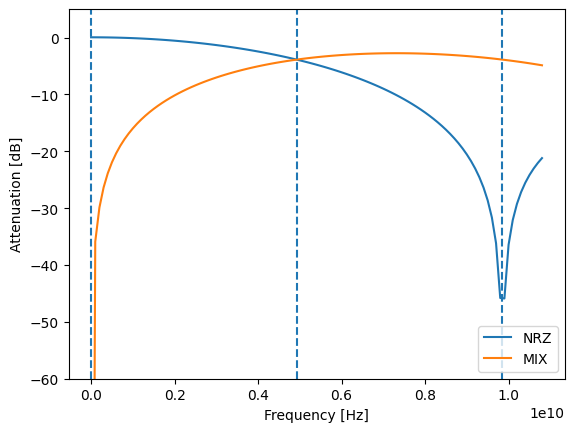
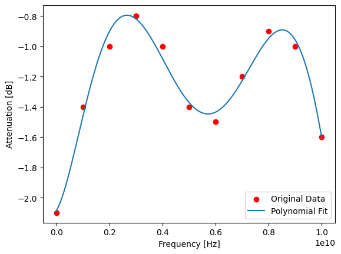
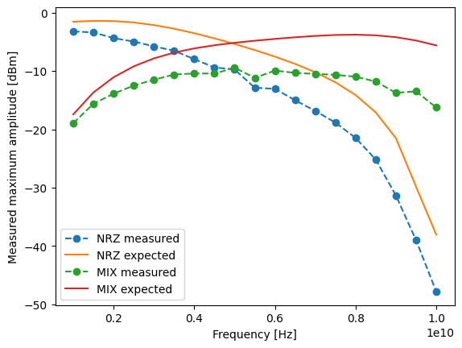
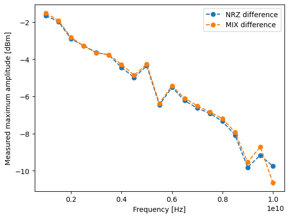
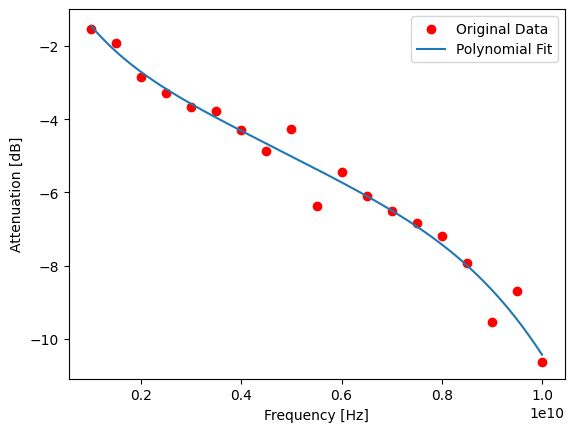
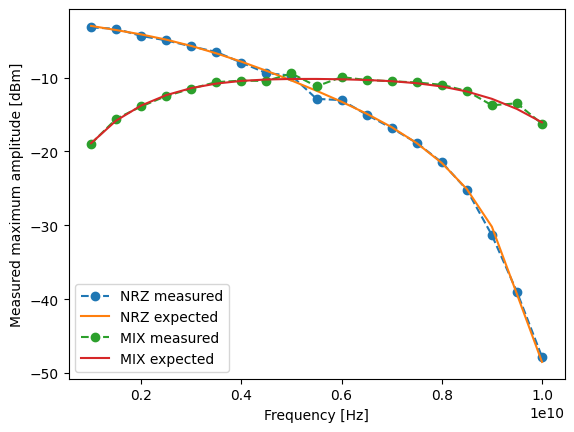

Calibrate QICK units
====================

QICK (and therefore Qibosoq) uses arbitrary units to set the amplitudes
of its pulses. It is not easy to directly connect a specific value of
amplitude to a physical one in volt or dBm because this depends on two
factors:

-  The frequency
-  The reconstruction waveform emplyoed (what the DAC syntesise between
   two samples)

In this document we will present a way of calibrating these units from
the values measured using a Spectrum Analyzer. The final objective is to
have a function that, given a frequency and an amplitude, returns the
corresponding dBm value.

.. code:: ipython3

    import numpy as np
    import matplotlib.pyplot as plt

Measured data
~~~~~~~~~~~~~

Data taken with a simple QICK script with a continuous tone. In this
case a RFSoC4x2 was used.

.. code:: ipython3

    # measured values for the non-return-to-zero mode (optimal for nqz=1)
    # first column is the frequency, second is the value in dBm
    measured_nrz = [
        (1, -3.22),
        (1.5, -3.4),
        (2, -4.37),
        (2.5, -4.97),
        (3, -5.78),
        (3.5, -6.54),
        (4, -7.98),
        (4.5, -9.4),
        (5, -9.74),
        (5.5, -12.88),
        (6, -13.06),
        (6.5, -15.02),
        (7, -16.85),
        (7.5, -18.85),
        (8, -21.47),
        (8.5, -25.18),
        (9, -31.33),
        (9.5, -39),
        (10, -47.8),
    ]

    # measured values for the mix mode (optimal for nqz=2)
    # first column is the frequency, second is the value in dBm
    measured_mix = [
        (1, -18.96),
        (1.5, -15.6),
        (2, -13.91),
        (2.5, -12.5),
        (3, -11.5),
        (3.5, -10.62),
        (4, -10.42),
        (4.5, -10.46),
        (5, -9.44),
        (5.5, -11.19),
        (6, -9.94),
        (6.5, -10.33),
        (7, -10.50),
        (7.5, -10.67),
        (8, -10.98),
        (8.5, -11.82),
        (9, -13.75),
        (9.5, -13.49),
        (10, -16.26),
    ]

    freqs = np.array([i[0] for i in measured_nrz])
    data = [i[1] for i in measured_nrz]
    plt.plot(freqs*1e9, data, "o--", label="NRZ measured")

    freqs = np.array([i[0] for i in measured_mix])
    data = [i[1] for i in measured_mix]
    plt.plot(freqs*1e9, data, "o--", label="MIX measured")

    plt.xlabel("Frequency [Hz]")
    plt.ylabel("Measured maximum amplitude [dBm]")
    plt.legend()

.. parsed-literal::

    <matplotlib.legend.Legend at 0x7d3e0c042c10>

Reconstruction Waveform
~~~~~~~~~~~~~~~~~~~~~~~

The first theoretical component to consider is the reconstruction
waveform. Each RW has different output attenuation for each frequency.
We here consider just the two RW used in QICK.

.. code:: ipython3

    SAMP = 9.85e9
    T = 1. / SAMP

    def nrz(f):
        omega = f * 2 * np.pi
        x = omega * T / 2
        return  T * np.exp(-1j * x) * np.sin(x)/x

    def mix(f):
        omega = f * 2 * np.pi
        x = omega * T / 4
        return x * T * np.exp(-1j * (omega * T - np.pi) / 2 ) * (np.sin(x)/x)**2

.. code:: ipython3

    def to_db(x, ref=1.01e-10):
        return (20 * np.log10(x/ref)).real

    freqs = np.arange(1, 1.1*SAMP, 1e8)
    plt.plot(freqs, to_db(nrz(freqs), 1.01e-10), label="NRZ")
    plt.plot(freqs, to_db(mix(freqs), 1.01e-10), label="MIX")

    plt.axvline(0, linestyle="--")
    plt.axvline(SAMP/2, linestyle="--")
    plt.axvline(SAMP, linestyle="--")

    plt.xlabel("Frequency [Hz]")
    plt.ylabel("Attenuation [dB]")
    plt.legend()

    plt.ylim(-60, 5)

.. parsed-literal::

    (-60.0, 5.0)

Balun attenuation
~~~~~~~~~~~~~~~~~

Each output of the RFSoC4x2 has a balun filter
(https://cdn.macom.com/datasheets/MABA-011118.pdf) that adds some
attenuation. From its datasheet we can take some of its values and fit
it to obtain an analytical function.

.. code:: ipython3

    # first column is frequency, second is the attenuation
    balun_data = [
        (0, -2.1),
        (1, -1.4),
        (2, -1),
        (3, -0.8),
        (4, -1),
        (5, -1.4),
        (6, -1.5),
        (7, -1.2),
        (8, -0.9),
        (9, -1),
        (10, -1.6)
    ]

    freqs = np.array([i[0] for i in balun_data])*1e9
    vals = [i[1] for i in balun_data]

    coeffs = np.polyfit(freqs, vals, 6)
    balun_ans = np.poly1d(coeffs)
    freqs_fit = np.linspace(min(freqs), max(freqs), 500)

    plt.scatter(freqs, vals, color='red', label='Original Data')
    plt.plot(freqs_fit, balun_ans(freqs_fit), label='Polynomial Fit')

    plt.xlabel("Frequency [Hz]")
    plt.ylabel("Attenuation [dB]")
    plt.legend()

.. parsed-literal::

    <matplotlib.legend.Legend at 0x7d3e03f2b310>

Maximum amplitude per frequency
~~~~~~~~~~~~~~~~~~~~~~~~~~~~~~~

The DACs, finally, indipendently on the RW, have a maximum power that
they can output for each frequency. We can find this by plotting the
expected (DDS + balun) answer and the measured one.

.. code:: ipython3

    def dds_balun(x, func=nrz):
        return (to_db(func(x), 1.01e-10) + balun_ans(x)).real

.. code:: ipython3

    freqs = np.array([i[0] for i in measured_nrz])*1e9
    data = [i[1] for i in measured_nrz]
    plt.plot(freqs, data, "o--", label="NRZ measured")
    plt.plot(freqs, dds_balun(freqs, nrz), label="NRZ expected")

    freqs = np.array([i[0] for i in measured_mix])*1e9
    data = [i[1] for i in measured_mix]
    plt.plot(freqs, data, "o--", label="MIX measured")
    plt.plot(freqs, dds_balun(freqs, mix), label="MIX expected")

    plt.xlabel("Frequency [Hz]")
    plt.ylabel("Measured maximum amplitude [dBm]")
    plt.legend()

.. parsed-literal::

    <matplotlib.legend.Legend at 0x7d3e03f05950>

If we look at the difference between expected and measured we can see
this is almost constant in respect to the RW. Therefore we can fit it
and obtain an analytical form:

.. code:: ipython3

    freqs = np.array([i[0] for i in measured_nrz])*1e9
    data = np.array([i[1] for i in measured_nrz])
    plt.plot(freqs, data - dds_balun(freqs, nrz), "o--", label="NRZ difference")

    freqs = np.array([i[0] for i in measured_mix])*1e9
    data = np.array([i[1] for i in measured_mix])
    plt.plot(freqs, data - dds_balun(freqs, mix), "o--", label="MIX difference")

    plt.xlabel("Frequency [Hz]")
    plt.ylabel("Measured maximum amplitude [dBm]")
    plt.legend()

.. parsed-literal::

    <matplotlib.legend.Legend at 0x7d3e03fed950>

.. code:: ipython3

    coeffs_att = np.polyfit(freqs, data - dds_balun(freqs, mix), 6)
    att_ans = np.poly1d(coeffs_att)

    freqs_fit2 = np.linspace(min(freqs), max(freqs), 500)
    # Plot the original data points
    plt.scatter(freqs, data - dds_balun(freqs, mix), color='red', label='Original Data')
    plt.plot(freqs_fit2, att_ans(freqs_fit2), label='Polynomial Fit')

    plt.xlabel("Frequency [Hz]")
    plt.ylabel("Attenuation [dB]")
    plt.legend()

.. parsed-literal::

    <matplotlib.legend.Legend at 0x7d3e01c57e10>

Final calculation
-----------------

.. code:: ipython3

    balun_ans

.. parsed-literal::

    poly1d([ 1.51960784e-58, -5.29600302e-48,  6.59521116e-38, -3.46432367e-28,
            6.21551213e-19,  2.87256959e-10, -2.08667215e+00])

.. code:: ipython3

    att_ans

.. parsed-literal::

    poly1d([ 3.34712268e-59, -1.43657042e-48,  2.29490068e-38, -1.89368959e-28,
            8.75578939e-19, -2.86407593e-09,  7.08743254e-01])

.. code:: ipython3

    def maximum_power(x, func=nrz):
        return (to_db(func(x), 1.01e-10) + balun_ans(x) + att_ans(x)).real

    freqs = np.array([i[0] for i in measured_nrz])*1e9
    data = [i[1] for i in measured_nrz]
    plt.plot(freqs, data, "o--", label="NRZ measured")
    plt.plot(freqs, maximum_power(freqs, nrz), label="NRZ expected")

    freqs = np.array([i[0] for i in measured_mix])*1e9
    data = [i[1] for i in measured_mix]
    plt.plot(freqs, data, "o--", label="MIX measured")
    plt.plot(freqs, maximum_power(freqs, mix), label="MIX expected")

    plt.xlabel("Frequency [Hz]")
    plt.ylabel("Measured maximum amplitude [dBm]")
    plt.legend()

.. parsed-literal::

    <matplotlib.legend.Legend at 0x7d3e15d5fcd0>

